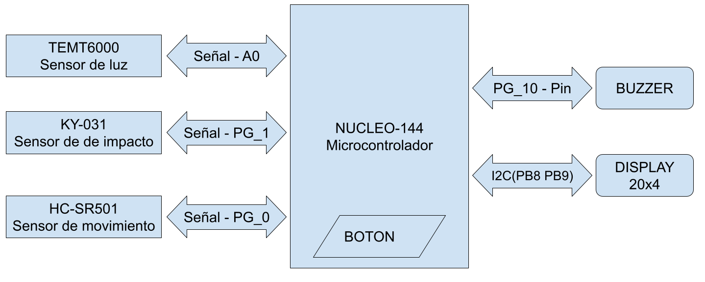

# Trabajo integrador de ISE

Este trabajo se realiza como proyecto integrador de la materia Introduccion a Sistemas Embebidos en el contexto de la Carrera de Especializacion en Internet de las Cosas (FIUBA).

# Proyecto: Food Deposit

## Introduccion

Desarrolla un sistema de detección de plagas para un depósito de comida para animales. El proyecto supone un contenedor donde se mantiene el alimento, a modo de depósito, para ser posteriormente distribuido. El sistema en cuestión debe detectar ingresos para tener control sobre la actividad del contenedor. De esa forma, se podría llevar registro de cuando se quitó alimento del interior. Se evalúa tener sensores capaces de detectar movimientos bruscos dentro del contenedor, dando pauta de plagas podría intentar acceder al alimento rascando el contenedor. Adicionalmente se agrega un sensor de luminosidad para medir la luz a la que se encuentra al expuesto el contenedor.

## Materiales utilizados

 - Placa de desarollo [NUCLEO-144](https://ar.mouser.com/ProductDetail/STMicroelectronics/NUCLEO-F429ZI?qs=mKNKSX85ZJcE6FU0UkiXTA%3D%3D)
 - Sensor de luz [TEMT6000](https://www.alldatasheet.com/datasheet-pdf/pdf/117488/VISHAY/TEMT6000.html)
 - Sensor de impacto [KY-031](https://datasheetspdf.com/pdf-file/1402041/Joy-IT/KY-031/1)
 - Detector de movimiento [HC-SR501](https://www.mpja.com/download/31227sc.pdf)
 - Display [LCD 20x4](https://www.futurlec.com/LED/LCD20X4.shtml)
 - Miscelaneos varios (cables, tuercas, tornillos, etc)

 ## Implementación del sistema

El programa fue desarrollado en el lenguaje de programación C/C++ utilizando el entorno de desarrollo [Mbed-OS](https://os.mbed.com/mbed-os/) aprovechando sus compilador online y sus librerías.

 ### Conexión de componentes

Para el desarrollo del proyecto, se conectado cada uno de los modulos al microcontrolador, utilizando los diferentes puertos que este proveé.

 

La estructura del programa realiza la declaración de los pines de entrada y salida, así como la inicialización de puertos e interrupciones. En el programa principal, se asocian funciones a las interrupciones configuradas para después comenzar con un bucle que se ejecuta indefinidamente. Dentro de este bucle se chequea si el botón interno de la placa esta presionado; ya que el mismo sirve como botón de "mantenimiento" para que los usuarios puedan retirar comida de su interior sin activar la alarma. también se chequea que no haya detecciones de plagas (disparada por interrupción a través del sensor de choque). Se mide la luz y se muestra por pantalla este valor, al igual que el estado del sensor de movimiento dentro del contenedor. Cada 10 segundos se prende un led testigo para verificar que el correcto funcionamiento del sistema.

### Diagrama de flujo

 

### Montaje de componentes

Con intenciones de hacer una prueba de concepto, se realizó el montaje de los componetes de tal forma que simular contenedor que disponga de todos los elementos antes mencionados

 

 ## Importar proyecto

  - Github: [link](https://github.com/ciror00/ise_tp)
  - Mbed-OS: [link](https://os.mbed.com/users/ciror00/code/FoodDeposit/)